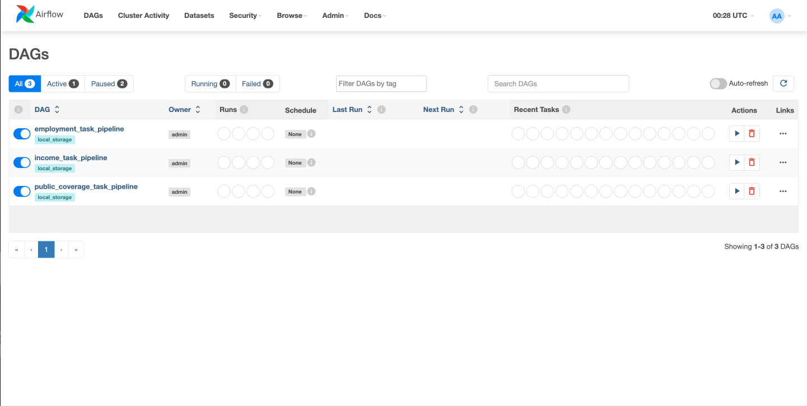
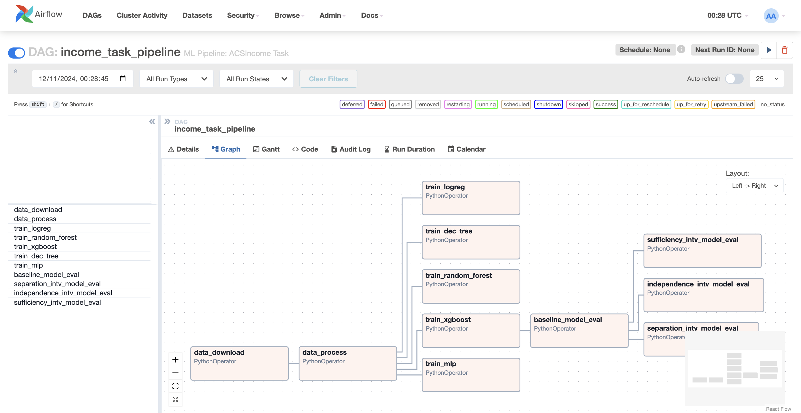

# Machine Learning Workflow


## Installing dependencies to work locally.

Create and activate your Python environment (pyenv or conda), clone or download the repository.
```
cd ai-system-framework
pip install -e .
```
or `pip install -e . "[dev]"`

### Docker

Docker is a requirement, check the installation instruction for your OS system [here](https://docs.docker.com/desktop/?_gl=1*vcfvc4*_ga*NjExMjk4OTMzLjE3MTY5NTM0MjM.*_ga_XJWPQMJYHQ*MTcxNjk1MzQyMi4xLjEuMTcxNjk1MzQyOS41My4wLjA.).

After installed docker in your system, return to the source code.

Create a `.env` file and populate with: `AIRFLOW_UID=1000`.

```
cd ai-system-framework
docker build . --tag extending_airflow:latest
docker compose up airflow-init
docker compose up -d
```

NOTES:
- Acess the airflow in localhost:8080
- To log in the UI: Username: `airflow`; Password : `airflow`
- The Airflow UI should be same as showing below.
- All modifications made in the `src` folder or in the dags folder implementations, will be reflected in the Airflow UI even with the docker image being up and running. 
- To stop the docker to run, just go to the terminal and `docker compose down`.
- For more information about the aiflow implementations [read the docs](https://airflow.apache.org/docs/apache-airflow/stable/index.html).
- Airflow has a lot of dags implemented as examples, that new users can copy and paste to modify for the necessary needs. To see all the examples in UI, stop the docker image, go to the `docker-compose.yaml` and change the parameter: `AIRFLOW__CORE__LOAD_EXAMPLES: 'false'` to `true`. All the aiflow dags examples will be showing in the UI, with the respective code.






