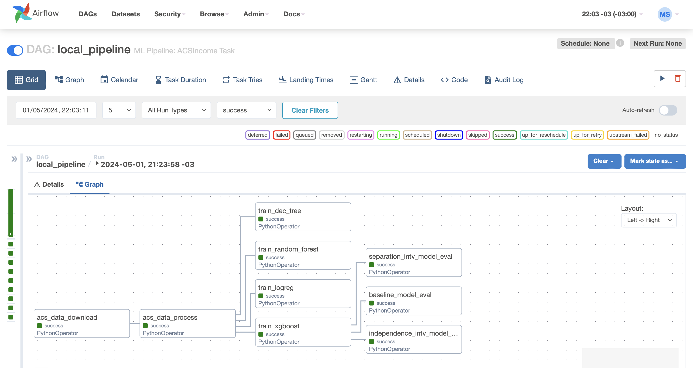

# Machine Learning Workflow


## Installing dependencies to work locally. 

Create and activate your Python environment (pyenv or conda), clone or download the repository.
```
cd ai-system-framework
pip install -e .
```

### Docker 

Docker is a requirement, check the installation instruction for your OS system [here](https://docs.docker.com/desktop/?_gl=1*vcfvc4*_ga*NjExMjk4OTMzLjE3MTY5NTM0MjM.*_ga_XJWPQMJYHQ*MTcxNjk1MzQyMi4xLjEuMTcxNjk1MzQyOS41My4wLjA.).

After installed docker in your system, return to the source code.

```
cd ai-system-framework
docker build . --tag extending_airflow:latest
docker compose up airflow-init
docker compose up -d
```
NOTES: 
- Acess the airflow in localhost:8080 
- To log in the UI: Username: `airflow`; Password : `airflow`
- The Airflow UI should be same as showing below.
- The code related to the  `DAG:local_pipeline` you can find in `src/dags/local_pipeline.py`. All modifications made in the `src` folder or in the dags implementations, will be reflected in the Airflow UI even with the docker image being up.
- To stop the docker to run, just go to the terminal and `docker compose down`. 
- For more information about the aiflow implementations [read the docs](https://airflow.apache.org/docs/apache-airflow/stable/index.html). 

The docker 
